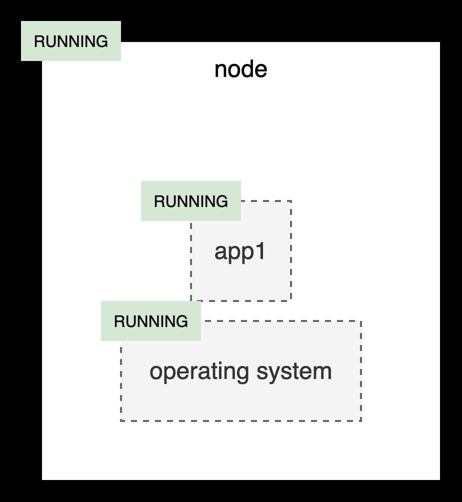
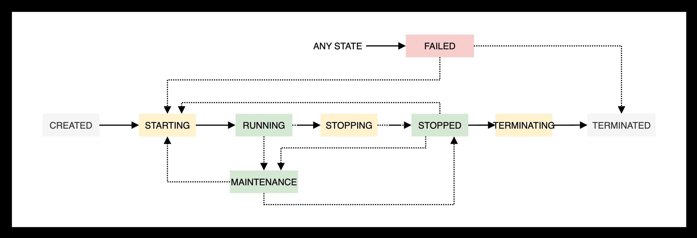

= Asset operation with state guard
:toc:
:toclevels: 3

== Overview

This document explains how to process asset stop and start operations in multi-layer system managed by multiple teams. As an example, consider a system composed of an operating system and an application installed on a service node. The node is a logical entity that groups  together resources accessible at single access address. Application may be deployed in a cluster across multiple nodes.

The application is owned by application team (SaaS) and node and the operating system is owned by platform team (PaaS).

== Operational state

Each element is represented by its operational state e.g. running, stopped to enumerate only basic two. Moreover node is represented by state degraded to indicate work on limited number of nodes. Moreover two simple rules are in place:

. Node is running when os, and app are running.
. Node is stopped when one of os, and app are stopped.

== Stopping and starting the system

Based on the state rules, the platform team must always validate both the node and application states before stopping the operating system. This rule prevents application data corruption that could result from an abrupt (hard) stop. In this case, the node depends on the application that stop process relays on node's state. Technical teams may proceed only when node's state is STOPPING. The node moves to STOPPED when both os and app are in STOPPED state.

Starting the system follows the reverse order. In this case, the node depends on the application's state, which in turn depends on the operating system's state — yet the overall control remains at the node level. When the node's state moves to STARTING, the operating system first transitions to RUNNING, followed by the application moving to RUNNING as well.

== State guard

The resource state is modeled using the finite state machine (FSM) paradigm, which defines the allowed flow of state changes. This model enables the implementation of a state guard service — a mechanism that prevents critical operations from being executed at inappropriate times (for example, stopping a system that is currently in production).

== Start State Guard

The State Guard is hosted on a GitHub and is freely available. Clone it to get the code.

[source,bash]
----
git clone https://github.com/rstyczynski/state_guard
----

The State Guard guard comes with CLI and REST API. For this exercise we will use REST version.

[source,bash]
----
cd state_guard
./bin/api --port 8080 --db data/demo.db --asset-dir examples
----

Start is manifested on a screen with number of messages.

----
2025/10/20 16:22:05 Initializing storage: data/demo.db
2025/10/20 16:22:05 Starting FSM API Server v2.2.0
2025/10/20 16:22:05 Asset directory: examples
2025/10/20 16:22:05 Database: data/demo.db
2025/10/20 16:22:05 Listening on http://localhost:8080
2025/10/20 16:22:05 
2025/10/20 16:22:05 Documentation:
2025/10/20 16:22:05   Interactive Docs: http://localhost:8080/docs
2025/10/20 16:22:05   OpenAPI Spec:     http://localhost:8080/openapi.yaml
2025/10/20 16:22:05 
2025/10/20 16:22:05 API Endpoints:
2025/10/20 16:22:05   Health:   GET    http://localhost:8080/api/v1/health
2025/10/20 16:22:05   POST   /api/v1/assets              - Create new asset
2025/10/20 16:22:05   GET    /api/v1/assets              - List all assets
2025/10/20 16:22:05   GET    /api/v1/assets/{id}         - Get asset details
2025/10/20 16:22:05   DELETE /api/v1/assets/{id}         - Delete asset
2025/10/20 16:22:05   POST   /api/v1/assets/{id}/transition - Execute state transition
2025/10/20 16:22:05   GET    /api/v1/assets/{id}/history - Get state history
2025/10/20 16:22:05 
2025/10/20 16:22:05 Starting API server on :8080
----

State Guard is loaded with default models, that will be used by this exercise.

== Webhook

State Guard emits HTTP events that will be received by Ansible Rulebook. Open another terminal with this repository as a current directory and run:

[source,bash]
----
git clone https://github.com/rstyczynski/ansible_eda
----

Open another terminal and run:

[source,bash]
----
cd ansible_eda
ansible-rulebook -r hello_rulebook_url.yml -i inventory.ini -S .
----

Ansible rulebook starts silently. You will see incoming events.

== Asset registration

To model exemplary system we need to register three assets: node, os, and app. I'll use Ansible playbook to do this. The playbook uses toolchain.fsm.asset_register role to perform initial registration followed by synthetic state transitions to STARTING, and RUNNING states.

[source,bash]
----
ansible-playbook playbooks/fsm/register_assets.yml
----

Asset registration created two results: (1) state guards is now aware of assets, (2) ansible EDA playbooks are triggered by state triggered events.

=== Assets

To see the assets at the state guards directly use REST API. You may do it from web 'http://localhost:8080/docs#/assets/listAssets' or from CLI.

[source,bash]
----
curl -s http://localhost:8080/api/v1/assets  | jq
----

[source,json]
----
{
  "assets": [
    {
      "id": "node1",
      "asset_type": "simple_asset_type.yaml",
      "definition_name": "generic_lifecycle",
      "current_state": "RUNNING",
      "available_transitions": [
        "STOPPING",
        "MAINTENANCE",
        "FAILED"
      ],
      "is_final_state": false,
      "created_at": "2025-10-20T16:28:39.211158+02:00",
      "updated_at": "2025-10-20T16:28:43.199606+02:00"
    },
    {
      "id": "app1",
      "asset_type": "simple_asset_type.yaml",
      "definition_name": "generic_lifecycle",
      "current_state": "RUNNING",
      "available_transitions": [
        "STOPPING",
        "MAINTENANCE",
        "FAILED"
      ],
      "is_final_state": false,
      "created_at": "2025-10-20T16:28:38.459572+02:00",
      "updated_at": "2025-10-20T16:28:42.646742+02:00"
    },
    {
      "id": "os1",
      "asset_type": "simple_asset_type.yaml",
      "definition_name": "generic_lifecycle",
      "current_state": "RUNNING",
      "available_transitions": [
        "STOPPING",
        "MAINTENANCE",
        "FAILED"
      ],
      "is_final_state": false,
      "created_at": "2025-10-20T16:28:37.765293+02:00",
      "updated_at": "2025-10-20T16:28:42.083514+02:00"
    }
  ],
  "count": 3
}
----

=== Events

Now take a look at rulebook terminal to see the events generated by the state guard.

----
[WARNING]: Found both group and host with same name: localhost

PLAY [Hello] *******************************************************************

TASK [Debug full event object] *************************************************
ok: [localhost] => {
    "event": {
        "meta": {
            "endpoint": "webhooks/server-running",
            "headers": {
                "Accept-Encoding": "gzip",
                "Content-Length": "165",
                "Content-Type": "application/json",
                "Host": "localhost:8081",
                "User-Agent": "FSM-Webhook/1.0",
                "X-Event-Type": "server-running"
            },
            "received_at": "2025-10-20T14:28:42.089115Z",
            "source": {
                "name": "Listen for HTTP Post",
                "type": "ansible.eda.webhook"
            },
            "uuid": "74692b4b-9039-40c1-88b7-455235c4fff7"
        },
        "payload": {
            "asset_type": "simple_asset_type.yaml",
            "from_state": "STARTING",
            "instance_id": "os1",
            "metadata": {},
            "timestamp": "2025-10-20T16:28:42.083985+02:00",
            "to_state": "RUNNING"
        }
    }
}

PLAY RECAP *********************************************************************
localhost                  : ok=1    changed=0    unreachable=0    failed=0    skipped=0    rescued=0    ignored=0   
[WARNING]: Found both group and host with same name: localhost

PLAY [Hello] *******************************************************************

TASK [Debug full event object] *************************************************
ok: [localhost] => {
    "event": {
        "meta": {
            "endpoint": "webhooks/server-running",
            "headers": {
                "Accept-Encoding": "gzip",
                "Content-Length": "165",
                "Content-Type": "application/json",
                "Host": "localhost:8081",
                "User-Agent": "FSM-Webhook/1.0",
                "X-Event-Type": "server-running"
            },
            "received_at": "2025-10-20T14:28:54.553868Z",
            "source": {
                "name": "Listen for HTTP Post",
                "type": "ansible.eda.webhook"
            },
            "uuid": "514788a7-f656-43a7-bb1d-3f062d69f9e9"
        },
        "payload": {
            "asset_type": "simple_asset_type.yaml",
            "from_state": "STARTING",
            "instance_id": "app1",
            "metadata": {},
            "timestamp": "2025-10-20T16:28:42.64691+02:00",
            "to_state": "RUNNING"
        }
    }
}

PLAY RECAP *********************************************************************
localhost                  : ok=1    changed=0    unreachable=0    failed=0    skipped=0    rescued=0    ignored=0   
[WARNING]: Found both group and host with same name: localhost

PLAY [Hello] *******************************************************************

TASK [Debug full event object] *************************************************
ok: [localhost] => {
    "event": {
        "meta": {
            "endpoint": "webhooks/server-running",
            "headers": {
                "Accept-Encoding": "gzip",
                "Content-Length": "167",
                "Content-Type": "application/json",
                "Host": "localhost:8081",
                "User-Agent": "FSM-Webhook/1.0",
                "X-Event-Type": "server-running"
            },
            "received_at": "2025-10-20T14:28:54.562566Z",
            "source": {
                "name": "Listen for HTTP Post",
                "type": "ansible.eda.webhook"
            },
            "uuid": "94faced5-3f9a-41db-8431-c53f9895799b"
        },
        "payload": {
            "asset_type": "simple_asset_type.yaml",
            "from_state": "STARTING",
            "instance_id": "node1",
            "metadata": {},
            "timestamp": "2025-10-20T16:28:43.202532+02:00",
            "to_state": "RUNNING"
        }
    }
}

PLAY RECAP *********************************************************************
localhost                  : ok=1    changed=0    unreachable=0    failed=0    skipped=0    rescued=0    ignored=0  
----

During this initial phase of the exercise you just learned critical elements of the system:

. State Guard process that takes care of state transitions acting as a guardian element

. Ansible toolchain.fsm roles to interact with the state guard via REST API

. Event Driven Ansible to invoke playbooks via HTTP request

== System stop

After initial registration with synthetic start we would like to stop the system. Operator uses os_stop role provided by a platform team. Note that for simplicity playbook works on a `localhost` and stop action is just a pause for 5 seconds.

[source,bash]
----
ansible-playbook playbooks/os/os_stop.yml 
----

----
(...)
TASK [toolchain.fsm.state_assert : Extract current state from response] ***********************************
ok: [localhost] => changed=false 
  ansible_facts:
    state_assert_actual_state: RUNNING

TASK [toolchain.fsm.state_assert : Assert current state matches expected] *********************************
fatal: [localhost]: FAILED! => changed=false 
  assertion: state_assert_actual_state == state_assert_expected_state
  evaluated_to: false
  msg: Assertion failed

PLAY RECAP ************************************************************************************************
localhost                  : ok=9    changed=0    unreachable=0    failed=1    skipped=0    rescued=0    ignored=0   
----

Your action is stopped by guard build into the os_stop role, that requires proper state before actual stop. Operator tries to enforce STOPPED state by hacking state guard.

[source,bash]
----
curl -X POST http://localhost:8080/api/v1/assets/os1/transition \
  -H "Content-Type: application/json" \
  -d '{
    "to_state": "STOPPED"
  }'
----

Again his action is rejected; this time by a state guard.

[source,json]
----
{
  "error": "Bad Request",
  "message": "Transition failed: invalid transition from 'RUNNING' to 'STOPPED'",
  "code": 400
}
----

=== Proper stop order

Operating system (host) is element of a software stack that is installed on a node, and its lifecycle is tightly coupled with the stack. As top level asset in this model is node (for simplicity), operator need to request STOPPING state for the node.

[source,bash]
----
ansible-playbook playbooks/node/request_node_stop.yml 
----

Having node in STOPPING state operator can stop the os and application.

[source,bash]
----
ansible-playbook playbooks/node/node_stop.yml 
----

Now the node is stopped. Users are informed that service is unavailable.

This is a theoretical scenario that in reality is of course more complex. The point is that OS operations are covered by an Ansible role, that validates the resource state. The stop is not possible without a proper context.

== Starting the system

Starting the system is protected in the same way. Operator need to request STARTING state.

[source,bash]
----
ansible-playbook playbooks/node/request_node_start.yml 
----

, to be able to start the node.

[source,bash]
----
ansible-playbook playbooks/node/request_node_start.yml 
----

Look at state guard console to see transitions to RUNNING triggering webhooks.

----
2025/10/20 21:10:42 [Ryszards-MacBook-Pro.local/abcVwd5Kn1-000057] "GET http://localhost:8080/api/v1/assets/node1 HTTP/1.1" from [::1]:63378 - 200 282B in 1.445917ms
2025/10/20 21:10:43 Webhook queued: node1 STARTING → RUNNING
2025/10/20 21:10:43 [Ryszards-MacBook-Pro.local/abcVwd5Kn1-000058] "POST http://localhost:8080/api/v1/assets/node1/transition HTTP/1.1" from [::1]:63379 - 200 94B in 1.895417ms
2025/10/20 21:10:43 [Ryszards-MacBook-Pro.local/abcVwd5Kn1-000059] "GET http://localhost:8080/api/v1/assets/os1 HTTP/1.1" from [::1]:63382 - 200 280B in 595.5µs
2025/10/20 21:10:43 Webhook queued: os1 STARTING → RUNNING
2025/10/20 21:10:43 [Ryszards-MacBook-Pro.local/abcVwd5Kn1-000060] "POST http://localhost:8080/api/v1/assets/os1/transition HTTP/1.1" from [::1]:63383 - 200 94B in 859.291µs
2025/10/20 21:10:44 [Ryszards-MacBook-Pro.local/abcVwd5Kn1-000061] "GET http://localhost:8080/api/v1/assets/app1 HTTP/1.1" from [::1]:63384 - 200 281B in 644.042µs
2025/10/20 21:10:44 Webhook queued: app1 STARTING → RUNNING
2025/10/20 21:10:44 [Ryszards-MacBook-Pro.local/abcVwd5Kn1-000062] "POST http://localhost:8080/api/v1/assets/app1/transition HTTP/1.1" from [::1]:63385 - 200 94B in 832.292µs
----

Now look at Ansible EDA terminal to see that all three resources moved to RUNNING state.

----
        "payload": {
            "asset_type": "simple_asset_type.yaml",
            "from_state": "STARTING",
            "instance_id": "app1",
            "metadata": {},
            "timestamp": "2025-10-20T21:10:44.336905+02:00",
            "to_state": "RUNNING"
        }
----

== Conclusion

The presented scenario illustrates a powerful pattern where Ansible playbooks execute operational logic that is guarded by an external state machine — the State Guard. This creates a form of logic-driven FSM, where automation tasks act only when the surrounding system context allows them to.

Instead of embedding all validation rules within playbooks, the State Guard becomes a shared control authority enforcing lifecycle order, dependencies, and safe transitions. In this model, the logic is protected by the FSM — not the other way around — ensuring that automation cannot violate operational policies or perform unsafe actions.

The webhook presented in this scenario plays an additional role — it acts as a bridge between the State Guard and Ansible EDA, transforming each validated state transition into an actionable event. This enables FSM driven orchestration, where every component reacts immediately to state evolution while remaining under strict governance of the FSM.

Webhooks may be used to convert FSM into orchestration engine, when all states will be associated with business action. On this stage FSM handles on_entry and on_exit for a given state, however going into orchestration engine direction it may be necessary to react not on a state only, by tuple from->to, having coverage for each transition in the FSM.

Ansible EDA provides a convenient, low‑latency way to trigger playbooks by running a long‑lived service that listens for events. The trade‑off is operational ownership: you manage RBAC integration, process supervision, scaling/concurrency, secrets, log capture/retention, and playbook upgrade.

Alternatively, you can invoke GitHub Actions via REST to run playbooks in a managed CI environment, which fits GitHub‑centric workflows and offers built‑in execution isolation, audit logs, RBAC, and retention/observability — at the cost of higher start‑up latency and queueing semantics. 

For a fully managed Ansible runtime with policy, inventory, scheduling, and analytics, consider Red Hat Ansible Automation Platform (formerly Tower).

Key takeaways:

. State Guard process takes care of state transitions acting as a guardian element

. Ansible toolchain.fsm roles interacts with the state guard via REST API

. Ansible teams' owned roles uses toolchain.fsm to protect itself from state related mistakes

. Webhooks informs external processes about reaching or leaving a state - good for notification

. Webhook is not aware of transition (from->to) what disables it from triggering an unambiguous actions; failed->running is a different action that stopped->running.  

. Event Driven Ansible to invoke playbooks via HTTP request, what may be covered by GitHub workflow or Ansible Automation Platform.

. Finite State Machine is not an orchestration engine (Turing Machine). It covers very specialized function to control asset's state, however is not meant to control the logic flow.
