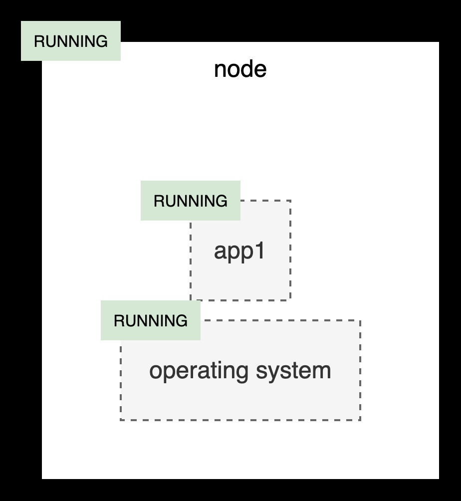

# Asset operation with state guard

This document explains how to process asset stop and start operations in multi-layer system managed by multiple teams. As an example, consider a system composed of an operating system and an application installed on a service node. The node is a logical entity that groups  together resources accessible at single access address. Application may be deployed in a cluster across multiple nodes.

The application is owned by application team (SaaS) and node and the operating system is owned by platform team (PaaS).

## Operational state

Each element is represented by its operational state e.g. running, stopped to enumerate only basic two. Moreover node is represented by state degraded to indicate work on limited number of nodes. Moreover two simple rules are in place:

1. Node is running when os, and app are running.
2. Node is stopped when one of os, and app are stopped.

## Stopping and starting the system

Based on the state rules, the platform team must always validate both the node and application states before stopping the operating system. This rule prevents application data corruption that could result from an abrupt (hard) stop. In this case, the node depends on the application that stop process relays on node's state. Technical teams may proceed only when node's state is STOPPING. The node moves to STOPPED when both os and app are in STOPPED state.

Starting the system follows the reverse order. In this case, the node depends on the application’s state, which in turn depends on the operating system’s state — yet the overall control remains at the node level. When the node’s state moves to STARTING, the operating system first transitions to RUNNING, followed by the application moving to RUNNING as well.

## State guard

The resource state is modeled using the finite state machine (FSM) paradigm, which defines the allowed flow of state changes. This model enables the implementation of a state guard service — a mechanism that prevents critical operations from being executed at inappropriate times (for example, stopping a system that is currently in production).

